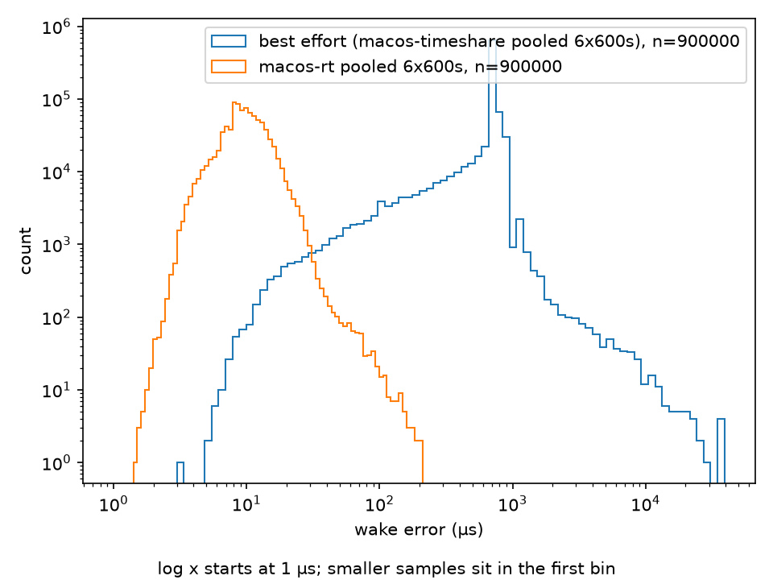

# flight-fault-injection

Companion to [epuck-edge-ai](https://github.com/sukethrp/epuck-edge-ai)
(on-device inference latency). This repo measures what happens when that
inference — or any sensor stream — arrives late, wrong, or not at all.

## Results

Wake-up error in microseconds, 250 Hz loop. Identical application code in
every row; Darwin `THREAD_TIME_CONSTRAINT_POLICY` is the variable. macOS
rows are six alternating 600-second runs pooled
(`results/hour_ts_1.csv`–`hour_ts_6.csv`,
`results/hour_rt_1.csv`–`hour_rt_6.csv`; percentiles in `results/pooled.md`).
900,000 samples per configuration. Overruns are the sum of the `overruns=`
header fields on those twelve files.

| Configuration | Samples | p50 | p99 | p99.9 | p99.99 | max | overruns |
|---|---|---|---|---|---|---|---|
| macOS, best effort | 900000 | 707 | 880 | 2028 | 8522 | 39127 | 613 |
| macOS, THREAD_TIME_CONSTRAINT_POLICY | 900000 | 10 | 24 | 42 | 95 | 225 | 0 |



Log x and log y. First bin starts at 1 µs; smaller samples sit there.

Socket drain, same RT policy, 600 s (`results/p2.md`). 400 Hz × 76-byte
loopback UDP against a dummy sender. `rx_total=240000` (1.6 per tick),
`drain_full=36`.

| Configuration | Samples | p50 | p99 | p99.9 | p99.99 | max | rx_total | drain_full |
|---|---|---|---|---|---|---|---|---|
| macOS RT, no socket | 150000 | 8 | 22 | 40 | 77 | 343 | 0 | 0 |
| macOS RT, UDP drain | 150000 | 7 | 20 | 34 | 79 | 536 | 240000 | 36 |

The Phase 2 pair is internally comparable; cross-phase max comparisons are not.
Phase 1 RT max 225 µs and Phase 2 no-socket max 343 µs differ by machine state
between days, not by the socket.

Darwin timeshare leeway is about 0.18 of the requested interval
(`results/rates.md`). The RT floor is absolute, 8–12 µs across 100–1000 Hz
(`results/rates_rt.md`), so the relative win shrinks at higher rates. 250 Hz
was a conservative choice for the histogram, not a lucky one.

| Hz | period µs | timeshare p50 | RT p50 | RT / period |
|---|---|---|---|---|
| 100 | 10000 | 1883 | 12 | 0.12% |
| 250 | 4000 | 767 | 10 | 0.25% |
| 500 | 2000 | 367 | 8 | 0.40% |
| 1000 | 1000 | 166 | 8 | 0.80% |

Darwin computation/constraint now scale as 3/16 and 1/2 of the period
(`results/rates_rt2.md`), so the 250 Hz claim stays 750 µs / 2 ms and
1 kHz is 188 µs / 500 µs. Same 60 s, load 200 µs, `--rt`: wake p50 is
13 / 10 / 10 / 8 µs at 100 / 250 / 500 / 1000 Hz. At 1 kHz, exec p99
200 µs is 107% of the 188 µs claim; `scheduler_applied` stays 1.

MAVLink v2 HIGHRES_IMU, 75 bytes on the wire, 400 Hz. Same RT policy, 600 s
(`results/p2_mavlink.md`). Compared to the 2a dummy UDP drain
(`results/p2_socket.csv.gz`). `parse_ok=240000` matches `rx_total`.
`seq_gaps=0`. exec p50 511.3 → 515.4 µs.

| Configuration | Samples | p50 | p99 | p99.9 | p99.99 | max | parse_ok | seq_gaps |
|---|---|---|---|---|---|---|---|---|
| macOS RT, UDP drain (2a) | 150000 | 7 | 20 | 34 | 79 | 536 | | |
| macOS RT, HIGHRES_IMU parse | 150000 | 10 | 23 | 40 | 74 | 477 | 240000 | 0 |

A same-sender parse on/off pair (`results/p2b.md`) moved exec p50 the
other way by 4 µs, so the +4.1 here is scatter, not a parse tax. Cross-run
exec p50 is not a stage cost. Parse cost is unresolved; measure it with
the in-run `rx_ns` column instead.

Latest-value IMU slot plus `skew_ns`, same RT policy, 600 s
(`results/p2_slots.md`). `parse_ok=rx_total=240000`, `seq_gaps=0` with
the uint8 wrap mask, `drain_full=15`. exec p50 515.4 → 515.0 µs.

| Configuration | Samples | p50 | p99 | p99.9 | p99.99 | max | parse_ok | seq_gaps |
|---|---|---|---|---|---|---|---|---|
| macOS RT, HIGHRES_IMU parse (2b) | 150000 | 10 | 23 | 40 | 74 | 477 | 240000 | 0 |
| macOS RT, latest-value slots (2c) | 150000 | 10 | 22 | 38 | 82 | 171 | 240000 | 0 |

`skew_ns` (IMU ticks only, n=149804): min -18872666, max -9166. First vs
last 10% of the run differs by -21 µs over ~480 s. The detector uses that
slope; the fixture offset is transport plus wait-until-next-tick, not a
second clock.

Age is sampled at tick boundaries, per slot. At 250 Hz with
`staleness_limit_periods=3` the theoretical detection floors
(`ceil(limit / loop_period) * loop_period` in the CSV header) are IMU
8 ms, position 60 ms, GPS 600 ms. The fault table Floor column is that
number, once a fault is injected.

Closed-loop tracking against the plant, 240 s at 250 Hz / 50 Hz control,
noise off (`results/p3_tracking.md`, truth `results/p3_truth.csv`). Hold
4 s + lap 20 s per cycle; steady window drops the first cycle (catch-up
from free-fall). Wake percentiles for the same run:
`results/p3_closed.md`.

| window | axis | peak \|e\| (m) | RMS (m) | hold RMS (m) | lap RMS (m) |
|---|---|---|---|---|---|
| steady | N | 0.4804 | 0.3053 | 0.0176 | 0.3366 |
| steady | E | 0.4829 | 0.3023 | 0.0119 | 0.3283 |
| steady | D | 0.0035 | 0.0003 | 0.0005 | 0.0001 |

Hold RMS scores only the final 2 s of each 4 s hold
(`analysis/tracking_error.py`), so lap-entry settling is excluded. ω sweep
at halved ω (`results/p3_tracking_omega40.md`, 40 s laps): lap RMS N/E
0.1737 / 0.1729 m (ratio 0.52 / 0.53 vs 20 s) — linear in ω, phase lag,
not ω² amplitude attenuation. Re-windowed hold RMS N/E 0.0080 / 0.0104 m
no longer tracks the lap ratio the way the full-hold window did. Predicted
tangential error `R·atan(ωτ)` with τ=0.05 s is 0.031 m (20 s) / 0.016 m
(40 s); measured lap RMS is ~10× larger, so plant lag sets the ω scaling
but not the absolute magnitude (outer-loop lag remains). The N/E vs D
asymmetry is phase lag; the earlier "hold also moved" objection was the
scoring window.

Estimator error against plant truth (clean and per fault class):
`results/estimator_error.png` — empty until the fault campaign lands
numbers in `results/fault_campaign/`.

### Fault table

Time-to-detect is injector-stamp to detector-fire on the same monotonic
clock (`rt::now_ns()`, one process tree on one Mac). Floor is
`ceil(limit / loop_period) * loop_period` from the run header, not a
measured TTD. Empty cells mean not measured. Campaign:
`scripts/fault_campaign.sh` (11 faults × 50 reps × 600 s, plus one clean
control per session).

| Fault | Injection | Detector | TTD p50 | TTD p95 | TTD max | Floor | TTR | End state |
|---|---|---|---|---|---|---|---|---|
| imu_dropout | type-selective drop msgid 105 | staleness IMU | | | | 8 ms | | |
| pos_dropout | type-selective drop msgid 32 | staleness POS | | | | 60 ms | | |
| gps_dropout | type-selective drop msgid 24 | staleness GPS | | | | 600 ms | | |
| packet_drop | Bernoulli drop | sequence gap | | | | 4 ms | | |
| packet_delay | delayed forward | staleness / skew | | | | | | |
| reorder | hold-and-reverse | sequence gap | | | | 4 ms | | |
| imu_bitflip | payload (AUTHOR) | NIS / divergence | | | | | | |
| imu_bias | payload (AUTHOR) | NIS / divergence | | | | | | |
| imu_stuck | payload (AUTHOR) | stuck variance | | | | 100 ms | | |
| gps_jump | payload (AUTHOR) | NIS | | | | | | |
| clock_skew | payload (AUTHOR) | skew slope | | | | | | |

TTD box plots with floors: `results/ttd.png`. State timeline for one
representative run (injection → detection → transition → recovery):
`results/state_timeline.png`. Both empty until the campaign CSVs exist.

## Reproduce

```bash
cmake -B build && cmake --build build
ctest --test-dir build --output-on-failure

# smoke, unprivileged
./build/loop_bench --hz 250 --seconds 60 --label smoke --out results/smoke.csv

# hour-scale jitter (what p99.99 needs at 250 Hz)
./build/loop_bench --hz 250 --seconds 3600 --load-us 800 --rt \
    --label "macos rt" --out results/loop_macos_rt_250hz.csv

# closed loop against the plant (no injector)
./build/plant --seconds 240 --sensor-port 14555 --setpoint-port 14556 \
    --acc-noise 0 --gyro-noise 0 --pos-noise 0 --gps-noise 0 \
    --truth-out results/plant_truth.csv --rt &
./build/loop_bench --hz 250 --seconds 240 --warmup 2000 --rt --ekf \
    --port 14555 --setpoint-port 14556 \
    --label p3-closed --out results/p3_closed.csv

# fault campaign: 11 × 50 × 600 s + clean control. resumes by skipping
# existing CSVs. wraps itself in nohup + caffeinate + disown.
./scripts/fault_campaign.sh

# figures (paths are explicit; no globbing inside the scripts)
python3 analysis/plot_jitter.py results/hour_ts_1.csv.gz results/hour_rt_1.csv.gz \
    --out results/jitter.png
python3 analysis/plot_estimator_error.py \
    --pair clean results/fault_campaign/clean_control.csv.gz \
                 results/fault_campaign/clean_control_truth.csv.gz \
    --out results/estimator_error.png
python3 analysis/plot_ttd.py results/fault_campaign/ttd_long.csv \
    --out results/ttd.png
python3 analysis/plot_state_timeline.py \
    --events results/fault_campaign/gps_dropout_r01_events.csv.gz \
    --detects results/fault_campaign/gps_dropout_r01_detects.csv.gz \
    --loop results/fault_campaign/gps_dropout_r01.csv.gz \
    --out results/state_timeline.png
```

`loop_bench` never aborts when it cannot get the scheduling policy it asked for.
It records what actually stuck in the CSV header, and the analysis warns on any
curve where real-time scheduling was requested and denied.

## Layout

```
src/           fixed-rate loop, EKF, detectors, failsafe, platform layer
tools/         plant and UDP sender fixtures
injector/      MAVLink proxy + fault configs (eleven one-fault .conf files)
analysis/      percentile tables and the four figures
scripts/       hour campaign, fault campaign, netfault, pre-commit hook
docs/          DESIGN.md sequencing, RUNBOOK.md operational footguns
results/       gzipped CSVs and figures (every README number traces here)
```

## Limitations

- No PREEMPT_RT, no `SCHED_FIFO`, no `isolcpus`, no `cyclictest` platform
  floor. There is no Linux host for this project; those numbers were not
  collected.
- Single host over loopback. Sender, injector, and `loop_bench` share one
  process tree and one `rt::now_ns()` epoch. There is no second machine and
  no cross-NIC clock offset in the TTD numbers.
- PX4 SITL was not used. Apple Silicon toolchain cost blocked it; the
  measurement that mattered was the drain, so `tools/plant.cpp` is the
  plant that shipped.
- The Linux branch in `rt_platform.cpp` is retained and has never been
  executed on this project. Every reported row is Darwin
  timeshare or `THREAD_TIME_CONSTRAINT_POLICY`.
- macOS cannot pin a thread to a core, and `mlockall` typically fails
  without root. The header records `memory_locked=0` /
  `affinity_set=0`; the curves are labelled for the configuration that
  actually applied.
- Everything is simulation. The timing and fault-behaviour numbers do not
  depend on a real vehicle; they also do not prove behaviour on one.
